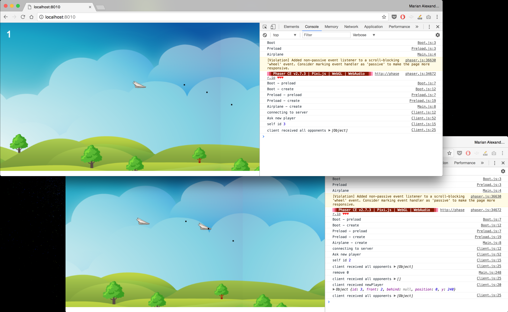

# FlappyBirdMultiplayer

Flappy bird multiplayer that can shoot each other done with **Phaser and Socket.io** and written in ES6

`npm install`
 
`npm test`
 
`npm start`

_Press space to jump and alt to shoot_